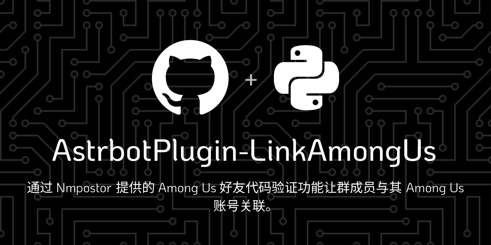

# LinkAmongUs



## 功能

- 通过 API 验证将 Among Us 账户与 QQ 账户关联
- 支持创建和检查验证请求
- 数据库存储验证信息
- 黑白名单管理
- 超时处理机制

## 安装

在 Astrbot WebUI 插件页面点击`安装`按钮，选择`从链接安装`，复制粘贴本仓库 URL 并点击安装即可。

> [!Warning]
> 此插件仅保证可在 NapCat 作为 aiocqhttp 适配器时可用。

## 使用

> [!important]
> 插件安装后需要进行配置，否则无法正常工作。

### 帮助菜单

```
/verify help
```
显示插件配置中定义的帮助菜单。

### 创建验证

```
/verify create <FriendCode>
```
创建一个验证请求，其中`<FriendCode>`用于验证账户的好友代码，该参数必填。

### 完成验证

```
/verify check
```
完成验证请求。\
由于 Nmpostor 不支持回调，因此需要通过该命令主动让插件请求 API 校验验证请求。

### 清理验证

```
/verify clean
```
清理数据表`VerifyLog`中已超时但状态仍处于已创建/重试中的验证请求。